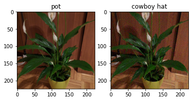
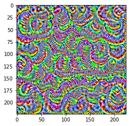
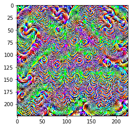
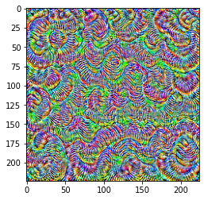

# Universal-Adversarial-Perturbations-Project

## CSE 598-Machine Learning Security and Fairness
This projects is submitted by: @ArshdeepSingh98, @vagarw28

This is a final project for Machine Learning Security and Fairness class.

There are 2 python notebooks, 

1. In 'Universal_AP_Fairness', this notebook creates Universal Adversarial Perturbation(UAP) for Inception model, and tests it on a sample Image. \
Demonstration of misclassification on a single image via UAP is shown below: \

2. In 'Combined UAP' notebook, we are creating UAPs from two individual networks ResNet50 and ResNet18, and interpolating their UAPs to do our experiement.
UAP Generated by Resnet50 and VGG16 are shown below: \

    Combined UAP with best reseult: \

